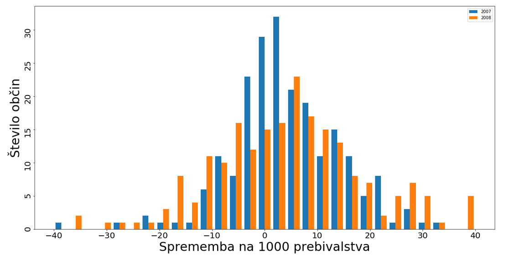
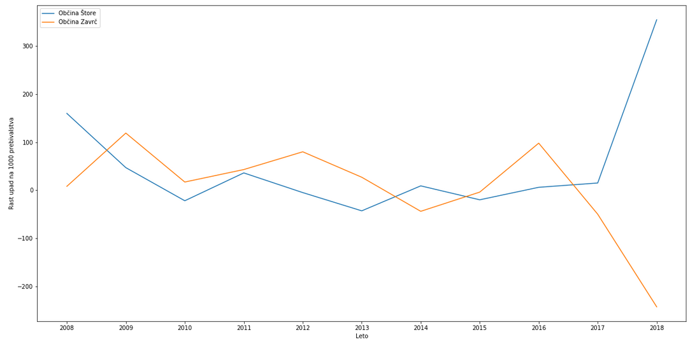

Podatkovno rudarjenje - Prebivalstvo v Sloveniji
================
Tilen Močnik, Jan Debelak, Lukas Kranjc

#### Problem

Za problem smo si izbrali porazdelitev in spreminjanje prebivalstva v Sloveniji. Zanima nas predvsem kje prebivalstvo najbolj upada, kaj vpliva na to da prebivalstvo v tej občini tako upada, ali obstajajo manjše občine kjer se prebivalstvo povečuje, primerjava upada prebivalstva z priseljevanjem ipd. Da bi problem bolje razumeli, smo najprej naredili graf za rast/upad prebivalstva za celotno Slovenijo.

#### Ugotovitve
Ugotovili smo da je prebivalstvo upadalo med leti 1998-2005 nato pa je začelo rasti do leta 2017, kjer je zopet začelo padati. Nato smo naredili primerjavo z priseljevanjem ljudi iz drugih držav. Ugotovimo da je večinoma število priseljencev večje od naravnega prirasta. Imamo pa tudi nekaj let ki zelo izstopajo. To so leta med 2005 in 2009, ter leto 2018.

Po teh ugotovitvah smo se osredotočili na rast prebivalcev po občinah v letih 2007 in 2008. Tokrat smo opazovali skupno rast prebivalstva po posameznih občinah (naravna prirast + priselitve) gledano na tisoč prebivalcev. Vidimo da imamo porazdelitev ki spominja na normalno.

Iz grafa je razvidno, da se prebivalstvo po občinah večinoma ne spreminja, saj je največ vrednosti prav okoli 0. Preverimo še ali se morda noramlna porazdelitev prilega podatkom za leto 2008.

Opazimo da se vse 3 porazdellitve dokaj prilegajo našim podatkom. Sedaj pa si poglejmo rast prebivalcev po občinah, ki najbolj izstopata. To sta občini Štore z največjo rastjo prebivalstva in občina Zavrč, kjer prebivalstvo najbolj upada.

Z uporabo gručenja bomo občine razdelili po skupinah glede na rast prebivalstva, tako bomo dobili še nekaj občin, ki so najbolj kritične (občine, ki so v isti skupini kakor Zavrč). Za gručenje smo poskusili nekaj metod, na koncu pa smo se odločili za povprečno vrednost gruče. Za razdaljo med gručami pa smo izbrali Evklidovo razdaljo.

